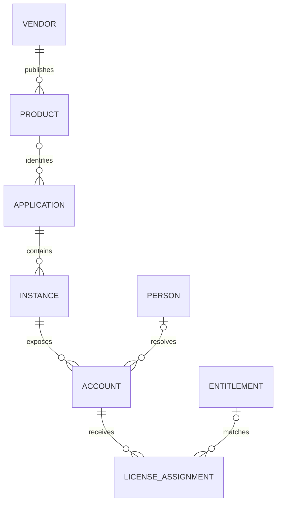
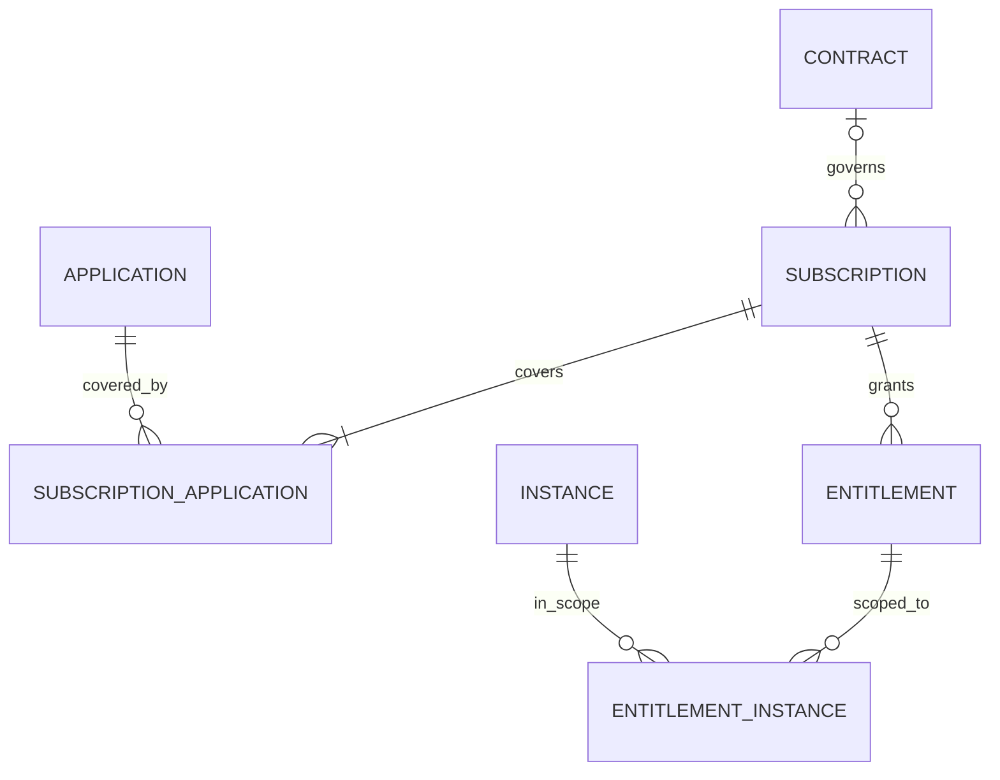

# SaaS system of record: proposed data model and API

Design proposal · 6 September 2026 · Contract version 0.1.0

The accompanying `saas-system-of-record.openapi.yaml` defines the proposed v1 resource API. It is a design contract, not an implemented service. Example domains, identifiers, amounts, and provider payloads are illustrative.

## 1. Recommendation and scope

Build a **tenant-scoped software catalog with a commercial ledger, observed access and usage, and an explainable reconciliation layer**. The product should answer: What software do we have? Where does it run? Who owns it? Who can access it? What did we buy? What are we actually paying? Which business systems depend on it? Why do we believe each answer?

Assume this serves organizations managing their own SaaS estate. A platform **Tenant** is one customer organization; an **Instance** is that customer's workspace, organization, or tenant inside a vendor's product. Keep those concepts distinct in names and authorization.

The influences are complementary:

| Reference | Relevant public pattern | Proposed design choice |
|---|---|---|
| Trelica / 1Password SaaS Manager | Contract renewals, entitlements versus actual usage, commitments versus expenditure | Separate contracts, subscriptions, entitlements, assignments, and spend records. |
| Zylo | Normalize financial, procurement, and IT information into software inventory and spend reporting | Preserve source evidence, deduplicate economic events, and make allocation and reporting basis explicit. |
| Backstage | Typed software and organizational entities, ownership, metadata, and relationships | Add a common catalog projection and typed relationship graph over domain tables. |

The first row is grounded in [SaaS Manager contract and renewal documentation](https://support.1password.com/saas-manager-manage-contracts-and-renewals/); the second in [Zylo's product description](https://zylo.com/product); the third in [Backstage's system model](https://backstage.io/docs/features/software-catalog/system-model/) and [entity descriptor format](https://backstage.io/docs/features/software-catalog/descriptor-format/). These are inspirations, not claims about those products' internal databases or API compatibility.

This system owns canonical software identity, classification, accountable ownership, reviewed mappings, and reconciliation decisions. HR remains authoritative for employment, vendors/IdPs for observed access, and the designated finance/procurement systems for financial facts. Local record updates never provision an account, terminate a vendor subscription, or make a purchase.

## 2. Core distinctions

**Vendor → Product → Application → Instance** is the inventory spine. A publisher may sell several products. A customer may track one product in multiple business contexts. Each application can have several actual vendor workspaces. For example: Salesforce the publisher; Salesforce CRM the product; Corporate CRM the application; production and sandbox the instances. A reseller can be the contract supplier without becoming the product publisher.

**Person → Account → LicenseAssignment** separates a human from their app-specific login and observed license grants. A person may have several accounts, and accounts may be service accounts, shared accounts, or unresolved identities. Email is a changing attribute and a matching signal, never an identifier.

**Contract → Subscription → Entitlement** separates legal terms, a commercial line/plan, and a purchased right. One contract can cover several subscriptions; one subscription can cover an application bundle. A license pool can span several instances. An assignment records an observed grant against that pool; usage records whether it was actually used.



The person relationship is optional: nonhuman and shared accounts also exist. A product match and an entitlement match may remain unresolved without inventing a relationship.



An entitlement scoped to all covered applications has no instance join rows; an explicitly scoped entitlement has one or more. That distinction is represented by `scope_type` in the API.

## 3. Logical relational model

Use typed relational tables for core business facts. All tenant-owned tables include `tenant_id`; resource tables also have permanent `id`, `created_at`, `updated_at`, and a monotonically increasing `revision`. Foreign keys are composite `(tenant_id, referenced_id)` so tenant isolation also holds in the database. External IDs are never used as internal primary keys.

### Catalog, people, and architecture

| Entity/table | Principal fields and foreign keys | Important constraint |
|---|---|---|
| `tenant` | id, name, default currency/timezone, retention configuration | A token is bound to exactly one tenant. Tenant administration is outside v1. |
| `entity_registry` | tenant_id, id, kind, typed resource locator | One matching typed row; supports catalog references without polymorphic dangling FKs. |
| `vendor` | name, website, domains | Names/domains are matching hints; they need not be globally unique. |
| `product` | vendor_id, name, slug, category, parent_product_id | Unique tenant/vendor/slug; suite parent is acyclic. Catalog is tenant-local. |
| `application` | product_id?, name, lifecycle, management_status, sanction_status, criticality, data_classification | Product match may be unknown. Approval and lifecycle are independent. |
| `instance` | application_id, provider_tenant_key?, environment, region, URL, status | Unique known provider tenant key per tenant/product. Shared real workspaces have one identity. |
| `person` | display_name, primary_email?, person_type, status, manager_person_id? | Stable source identifiers drive identity resolution; prevent manager cycles. |
| `service_principal` | name, purpose, status | Models nonhuman identity without inventing a human owner. |
| `group` | name, group_type, status | Types include team, department, cost center, legal entity, and access group. |
| `membership` | group_id, member_kind/id, role, valid_from, valid_to | Member is a person, service principal, or group. Nested groups form a DAG. |
| `ownership` | entity_id, owner_kind/id, role, is_primary, valid_from, valid_to | Owner is a person/group. At most one primary owner per entity/role at any time. |
| `account` | instance_id, provider_account_key, principal_kind/id?, account_type, status, provider_roles | Unique tenant/instance/provider_account_key; source-managed observed state. |
| `technical_asset` | asset_type, namespace, name, lifecycle, subtype, backstage_ref?, metadata | Types: domain, system, component, API, resource. Unique tenant/type/namespace/name. |
| `relationship` | source_entity_id, relation_type, target_entity_id, valid_from, valid_to | Validate endpoint kinds; derive inverse relations. No overlapping duplicate edge intervals. |

Ownership roles are business, technical, procurement, security, and billing. Ownership is accountability, not an authorization grant. An app may be discovered without an owner; making it managed should require a current primary business owner by policy.

Use the registry for application, instance, vendor, product, person, group, service principal, account, contract, subscription, entitlement, and technical asset identities. Specialized typed FKs still govern transactional joins. `/entities` exposes a small authorized projection; it is not a universal write API or a replacement for these tables.

### Commercial rights, observed usage, and actual spend

| Entity/table | Principal fields and foreign keys | Important constraint |
|---|---|---|
| `contract` | supplier_vendor_id, buying_entity_group_id, document refs, dates, notice_deadline, timezone, auto_renew, committed_value, parent/supersedes/renews IDs | Buyer is a legal entity. Keep executed legal terms immutable; amendments/renewals are linked versions. |
| `subscription` | contract_id?, name, SKU, pricing_model, billing_cadence, status, service dates, commitment and its dates | A free or self-serve plan may lack a contract. A bundled price is stored once. |
| `subscription_application` | subscription_id, application_id | Many-to-many bundle coverage; unique pair. API presents `application_ids`. |
| `entitlement` | subscription_id, SKU, type, capacity, unit, consumption_basis, metering_period, valid_from/to, scope_type | Capacity is fixed, unlimited, or unknown. Seat quantities are integral. |
| `entitlement_instance` | entitlement_id, instance_id | Instance's application must be covered by the subscription. API presents `instance_ids`. |
| `license_assignment` | account_id, entitlement_id?, provider_sku?, assignment_state, quantity, valid_from/to, provenance | Source-observed. Unmatched licenses remain visible. Validate scope and overlapping intervals. |
| `metric_definition` | key, version, unit, aggregation, signal_type, exact definition | Definition/version immutable; unique tenant/key/version. Authentication is distinct from product activity. |
| `usage_record` | instance_id, account_id?, metric_definition_id, window_start/end, value, coverage, observed_at, reconciliation_status | Canonical grain is metric + subject + nonoverlapping window. Retain duplicate/corrected evidence. |
| `spend_record` | source document/line, subscription_id?, amount/currency, accounting/service dates, record_type, basis, economic_event_key?, reconciliation_status | Same economic event may arrive from several feeds. Only a chosen canonical representation counts. |
| `spend_allocation` | spend_record_id, application_id, cost_center_group_id?, amount/currency | Allocation sums exactly to parent amount, or none means explicitly unallocated. |

All quantities/money use exact decimals, represented as strings in JSON. Dates and effective intervals use `[start, end)`. Normalize upstream inclusive end dates at ingestion and retain the original evidence. A cancellation deadline is an explicit timestamp interpreted from contractual terms and timezone; renewal date alone cannot safely produce it.

`contract.committed_value` is a whole-document reference total. `subscription.commitment` is the minimum committed amount over a specified interval. Neither is additive with the other or with actual spend. Subscriptions retain separate billing cadence and service term so an annual commitment billed monthly is unambiguous. Contract and line currencies must agree when linked; a multi-currency agreement uses separately modeled orders.

Entitlement consumption is explicit: count accounts, distinct resolved principals, instances, or measured usage. This supports a suite seat assigned to the same person through several accounts. Identity uncertainty makes that utilization uncertain. Do not silently count unknown capacity as zero or unlimited.

For actual spend, choose **one basis and one currency**. Invoice/credit lines belong to `invoiced`; payment/refund lines belong to `paid`. Expense connectors declare which basis their records represent. Credit/refund amounts are negative. Different feeds representing the same event are linked and deduplicated within a basis; equal merchant/date/amount alone is insufficient proof. Unresolved entries are excluded from settled totals and shown separately. Currency conversion is a derived report with its own FX rate/date/source, never an overwrite of original amounts.

### Evidence and operational support

| Entity/table | Purpose and key |
|---|---|
| `connection` | One upstream installation and its secret-store reference/capabilities. Unique tenant/provider/source_namespace; reconnecting reuses its identity. |
| `external_object_link` | Reviewed mapping from connection/object_type/external_id to a canonical entity, or an explicit ignore decision. Many source objects may resolve to one entity. |
| `observation` | Append-only source fact: external identity, source version/sequence, schema version, operation, effective/observed/received times, redacted payload hash/pointer. |
| `observation_resolution` | Versioned processing outcome and normalized resource locators; one observation can produce several output records. |
| `field_provenance` | Chosen source/manual value, rule version, observation references, freshness, conflicts, and override reference for each canonical field. |
| `field_override` | Typed, allowlisted field exception with reason, actor, expiry/revocation, and audit history. |
| `resource_revision` | Retained previous representations and transaction/effective times for historical reconstruction and cursor snapshots. Internal storage, not a public arbitrary as-of API in v1. |
| `sync_run`, `ingestion_batch`, `ingestion_item_result` | Checkpoints, processing state, independent record outcomes, failures, and retryability. |
| `audit_event` | Append-only actor/action/request/revision metadata for every change, including reconciliation and mapping edits. |
| `outbox_event`, `webhook_subscription`, `webhook_delivery` | Transactional change publication, subscriptions, retries, delivery identity, and replay. |

Permanent ingestion identity is `(tenant, connection, source_object_type, external_id, source_version)`. The external ID includes any provider sub-scope needed for uniqueness within the connection. Store a semantic payload/operation hash. Reobserving an identical version is a duplicate even if collection time changed; a different payload with that version is a conflict. Use a provider event ID/revision where available; otherwise the connector persists its own change sequence. Content hashes detect unchanged snapshots but cannot alone identify an A → B → A state sequence.

Useful indexes start with `tenant_id`: application product/status; instance application; account instance/provider key and principal; active ownership role/owner; subscription contract; renewal/deadline; assignment account/pool/time; usage instance/metric/window; spend basis/currency/accounting date; edges in both directions; external source keys; and server `updated_at,id`. Use transactional constraints for interval overlap, same-tenant references, and uniqueness.

## 4. Reconciliation and field authority

Sources write observations first. Normalize them through a versioned connector schema; resolve external identity; apply field-level authority rules; then commit accepted state, provenance, revision, audit event, and outbox record in one transaction. Unresolved matches remain reviewable through observation status. `/external-object-links` records a human-reviewed match or ignore decision and triggers re-reconciliation.

Suggested default authority policy:

| Field family | Preferred authority | Manual behavior |
|---|---|---|
| Employee status and manager | Configured HR source | Direct edits allowed only when unmanaged; no general override. |
| Account activation, grants, vendor roles | Native vendor API; IdP is corroborating evidence | Observations only. SSO assignment is not proof of a usable vendor account. |
| Contracts and commercial quantities | Designated procurement feed or reviewed manual entry | Draft editing; executed terms require linked amendments. |
| Actual spend | Designated finance source plus document-level matching | No financial ledger override. Corrections arrive as evidence/reversals. |
| App classification, criticality, lifecycle, labels | Reviewed catalog governance | Direct editing; an override can pin an allowlisted field with a reason/expiry. |
| Ownership | Explicit owner assignments, optionally seeded from directory/Backstage | Change effective-dated ownership records; no free-form owner string. |
| Architecture | Configured Backstage/Git catalog | Manual records allowed; source-managed fields reject direct writes. |

Rules are configured per tenant and field family, with a stable rule version; a rule administration API is deferred. Authority is granted to an explicitly configured connection, not automatically to any connection with a provider name such as `netsuite`. V1 override allowlist: application lifecycle, management_status, sanction_status, criticality, data_classification, and catalog description/labels/annotations/extensions. The target schema still applies. IDs, observed access, money, and commercial quantities are protected. Do not use a single last-write-wins policy for the entire entity.

Track `effective_at` (when true at source), `observed_at` (when collected), and `received_at` (when received here). Use provider sequence/version ordering where defined. Arrival order cannot safely overwrite a newer fact. If ordering or identity is ambiguous, retain both claims and raise a conflict; do not manufacture certainty from a confidence score. A connector outage yields stale/unknown data, not inactive accounts.

The public ingestion API accepts **deltas only**, with explicit tombstones. An internally executed full sync can infer disappearance only after every page of an authoritative collection succeeds and a configured grace policy is met. Failed or partial snapshots cannot remove users, assignments, or applications.

## 5. Backstage-inspired graph

Keep labels for filtering, annotations for external integration metadata, and namespaced extensions validated against registered JSON Schemas. An extension cannot replace a typed core field. Core kinds and valid edge types are versioned with the API; adding arbitrary unvalidated entity kinds is outside v1.

| Relation | Permitted source → target |
|---|---|
| `depends_on` | Application/Instance/Component/API/Resource → Application/Instance/Component/API/Resource |
| `uses` | Group/System/Component → Application/Instance |
| `provides_api` | Application/Instance/Component → API |
| `consumes_api` | Application/Instance/Component → API |
| `part_of` | Domain → Domain; System → Domain; Component/API/Resource → System |

Component/API/Resource/System/Domain here mean the corresponding `technical_asset.asset_type`. Reject self edges; prohibit cycles in `part_of`. Dependency cycles can be valid and should be reported, not universally prohibited. Store one directed relationship and derive its inverse. Ownership and membership use their dedicated tables and cannot be independently edited as generic edges.

A useful query is: Which production services depend on a SaaS instance whose contract has a notice deadline this quarter, and which team must decide? Answer it by joining graph edges to instances, entitlement scopes, subscription coverage, contracts, and ownership. Contracts without discovered instances must still appear in renewal reports as incomplete inventory links.

Backstage adapters map its external `kind:namespace/name` references to local stable UUIDs; a rename updates the mapping. Keep the SaaS commercial extension in an application-owned namespace or custom Backstage kind. Backstage's descriptor envelope and relation model inspire this adapter; the proposed REST API does not claim native Backstage compatibility. [Descriptor format](https://backstage.io/docs/features/software-catalog/descriptor-format/).

## 6. REST API surface

Base URL: `https://api.saas-record.example/v1` (illustrative). Collections use plural nouns and permanent UUIDs. GET/POST operate on collections; GET/PATCH on individual records where updates are supported.

| Resource collections | Supported operations | Purpose |
|---|---|---|
| `/vendors`, `/products`, `/applications`, `/instances` | List, create, get, patch | Inventory and catalog governance. |
| `/people`, `/groups`, `/service-principals` | List, create, get, patch | Canonical identity and organization. |
| `/memberships`, `/ownerships` | List, create, get, patch | End-date or update allowed relationship attributes. |
| `/accounts`, `/license-assignments` | List, get | Source-observed access and licenses. |
| `/contracts`, `/subscriptions`, `/entitlements` | List, create, get, patch | Commercial records with immutable-term/interval rules. |
| `/metric-definitions` | List, create, get, deprecate via patch | Versioned usage semantics. |
| `/usage-records`, `/spend-records` | List, get | Reconciled measurements and actual financial evidence. |
| `/technical-assets`, `/relationships` | List, create, get, patch | Architecture and dependency graph. |
| `/entities` | List/search, get | Authorized common catalog projection. |
| `/connections`, `/external-object-links` | List, create, get, patch | Source registration and reviewed identity links. |
| `/connections/{id}/sync-runs` | POST → 202 | Start an asynchronous provider pull. |
| `/connections/{id}/ingestion-batches` | POST → 202 | Submit up to 500 delta observations, maximum 8 MiB. |
| `/sync-runs`, `/ingestion-batches` | List, get | Inspect processing and outcomes. |
| `/ingestion-batches/{id}/items` | List | Inspect each input's status, evidence ID, outputs, and error. |
| `/observations` | List, get | Inspect source and resolution metadata; raw payloads remain restricted. |
| `/entities/{id}/provenance` | List | Explain source selection, freshness, and conflicts per field. |
| `/field-overrides` | List, create, get, revoke via patch | Explicit exceptions to supported governance fields. |
| `/audit-events` | List, get | Inspect durable change metadata. |
| `/webhook-subscriptions` | List, create, get, patch | Manage outbound event destinations and signing references. |
| `/events` | GET | Replay authorized change events retained for 30 days. |

Representative requests, all implemented in the proposed contract:

```http
GET /v1/applications?management_status=managed&limit=100
GET /v1/instances?application_id={applicationId}
GET /v1/accounts?instance_id={instanceId}
GET /v1/subscriptions?application_id={applicationId}
GET /v1/contracts?notice_on_or_before=2026-12-31T23:59:59Z
GET /v1/license-assignments?entitlement_id={entitlementId}&assignment_state=assigned
GET /v1/spend-records?basis=invoiced&currency=USD&reconciliation_status=canonical
GET /v1/relationships?target_id={instanceId}&relation_type=depends_on
GET /v1/entities/{applicationId}/provenance
GET /v1/observations?resolution_status=conflict
```

Creation example:

```http
POST /v1/applications
Authorization: Bearer <tenant-bound-token>
Content-Type: application/json
Idempotency-Key: 7d2f92e4-3f91-4e4b-b150-184a995ad8fc

{
  "product_id": "00000000-0000-4000-8000-000000000002",
  "name": "Corporate CRM",
  "lifecycle": "active",
  "management_status": "discovered",
  "sanction_status": "unreviewed",
  "criticality": "high",
  "data_classification": "confidential"
}
```

This returns `201 Created`, the application representation, a `Location`, and a strong `ETag` such as `"1"`. Add the primary business ownership record before making it managed. Subsequent PATCH requests send `If-Match: "1"`; a stale version returns 412.

### Contract conventions

- **Authorization:** OAuth2 client credentials for machines; authorization code with PKCE for interactive clients. Enforce tenant, row, referenced-object, and field permissions in addition to the listed domain scopes. Namespace and ownership do not grant permission. Finance and identity details require their own scopes, including through search, graph, evidence, audit, and events. Filter unauthorized rows without leaking total counts.
- **Pagination:** `{data: [...], page: {next_cursor, snapshot_at}}`; default 100, maximum 200. Use signed opaque keyset cursors tied to filters, current authorization, and a 15-minute consistent snapshot. Read retained revisions at that snapshot; recheck revocations on every page. Normal collections order by created_at/id; events by sequence; ingestion items by input index. Expired cursors return 410.
- **Updates:** PATCH uses `application/json` with a separate typed partial-update schema. Omitted fields are preserved; null clears only nullable fields; supplied maps and arrays replace the entire value. This is deliberately a documented partial-update format, not JSON Merge Patch. Reject unknown fields and invalid complete resulting state.
- **Idempotency:** Require `Idempotency-Key` on POST. Bind it to tenant, client, method, and path, with request hash/original response retained at least 24 hours. Same request replays; a changed payload returns 409. Source-event deduplication lasts independently of this request cache. Poll the returned Location after 202 or an uncertain result.
- **Errors:** `application/problem+json` with HTTP status, stable application code, request ID, and field-level pointers. Use 409 for state/identity conflicts; 412 for stale ETags; 422 for domain validation; 428 for missing If-Match; 429 plus Retry-After for rate limits. This follows [RFC 9457](https://www.rfc-editor.org/rfc/rfc9457.html).
- **Lifecycle:** No public hard delete in v1. Retire catalog records; end-date memberships, ownerships, assignments, and edges; retain contract versions and tombstones. Regulated retention and personal-data deletion require a separate privileged process with minimal retained audit metadata, not indefinite raw-PII retention.
- **Asynchrony:** A 202 is a receipt, not proof of successful reconciliation. Batches expose applied/duplicate/conflict/rejected per-record outcomes. A terminal batch is succeeded if every row was applied/duplicate, partial for mixed outcomes, failed if none were accepted. Accepted/rejected counts classify all rows at termination. Mapping changes can return the updated link immediately while affected projections reconcile afterward.
- **Events:** Commit outbox entries atomically with canonical mutations. Webhooks contain minimal entity references, revision, event ID, and changed paths. HMAC-sign the raw body and timestamp; deliver at least once with retries up to 24 hours. Consumers deduplicate IDs, tolerate reordering, and use the 30-day replay API. Recheck the subscription identity's permissions on every delivery.

The file uses [OpenAPI 3.1.1](https://spec.openapis.org/oas/v3.1.1.html) and JSON Schema 2020-12. It supplies typed create/update/read schemas, security scopes, filters, standard responses, async resources, examples, and an outbound webhook definition. Cross-record, state-transition, source-authority, and temporal constraints still need server-side enforcement.

## 7. Reporting rules and an example

Do not put manually writable `annual_spend`, `active_users`, `unused_seats`, or `risk_score` fields on an application. Compute projections with the measurement window, calculation version, source coverage, and last successful sync. V1 exposes the underlying records; aggregate report endpoints are a subsequent API addition.

For an illustrative pool with 100 purchased account-based seats and 90 currently assigned accounts, 10 are unassigned. If product-activity evidence covers all 90 accounts for the complete 30-day window and 60 meet the metric predicate, 30 assigned seats are candidates for review. If 20 accounts lack coverage, their usage is unknown; the system cannot call all 30 unused. Service/shared accounts may use a separate review policy.

Reclaiming a seat does not automatically lower a prepaid commitment. Model avoided renewal cost, reusable capacity, and realized financial savings separately. Paid invoices are not additional spend on top of the corresponding invoiced total. A bundle covering three applications still has one commercial amount; app allocation apportions that amount rather than tripling it.

## 8. Implementation boundary and rollout

Start with a modular service and workers backed by a transactional relational database. Keep source payloads/documents in encrypted object storage with retention and access controls. Use a transactional outbox and durable queue for integrations and event delivery. Add search and analytics projections as derived stores; start graph traversal with indexed relationship tables. This keeps identity and accounting constraints enforceable without requiring a separate graph database on day one.

Ship in three increments:

1. **Trustworthy inventory:** catalog, instances, people/groups, observed accounts, ownership, connector evidence, reviewed identity links, provenance, audit, and source health.
2. **Commercial truth:** contract versions, subscriptions/bundles, entitlement pools, effective assignments, usage definitions, spend reconciliation/allocations, and renewal reporting.
3. **Connected governance:** architecture graph/Backstage adapter, policies, findings, access reviews, and an execution layer.

The supplied contract describes the shared resource foundation across these increments. It intentionally does not define tenant/RBAC administration, secret exchange, document upload, connector-schema/authority-rule administration, arbitrary as-of queries, canonical entity merges/splits, aggregate reports, risk-assessment workflows, or vendor execution. Those need separate contracts when implemented; they are not hidden behavior of generic CRUD.

For vendor execution, later add typed `access_request`, `approval_decision`, and `operation` resources. An approved request produces an asynchronous operation; only a subsequent confirmed observation changes accepted access state. Permission to maintain records must remain separate from permission to execute a vendor action.

Before implementation, verify the essential invariants with representative scenarios: the same employee through HR and IdP; renamed/recreated vendor workspaces; one bundle across applications; invoice/payment/expense overlap; partial sync and out-of-order events; contractual amendment history; an inaccessible finance object queried through graph/evidence; and duplicate webhook delivery. These are the boundaries most likely to determine whether the system deserves to be treated as a record of fact.

## 9. Artifact checks

The accompanying YAML contains 61 paths, 99 resource operations, 116 schemas, and one outbound webhook definition. Local checks parsed the YAML, resolved all 1,223 local references, checked path parameters/security scopes/operation IDs, checked all five included examples, and confirmed rejection of ten representative invalid inputs. These are structural and example checks, not full OpenAPI conformance validation or tests of an implemented server.
